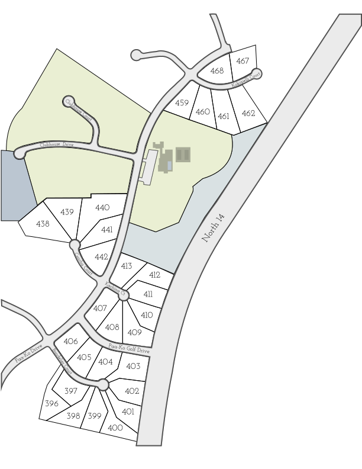
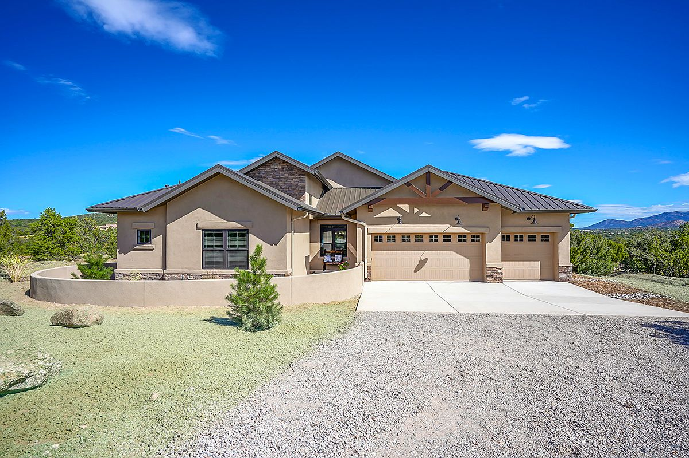

import {VRViewer} from '../../../src/components/mdx/vr-viewer/index.tsx'

# The Problem
How can you sell people on a location they have never been to? The idea was to take 360 degree pano shots. Now the question is how do you display them?

# The Solution
1. Create a web app with a plat map as the base display.

2. Make our lots with 360s clickable.
3. Display the lot with a 360 panorama

<VRViewer />

4. Watch for the **digital** lot to turn to this...

# Next Steps

This project was the jumping off point for the other programming projects at Abrazo Homes. After the initial project was done. The question became how do we have lot availability update automatically.

That is when attention turned to setting up an API for the data we had available.
