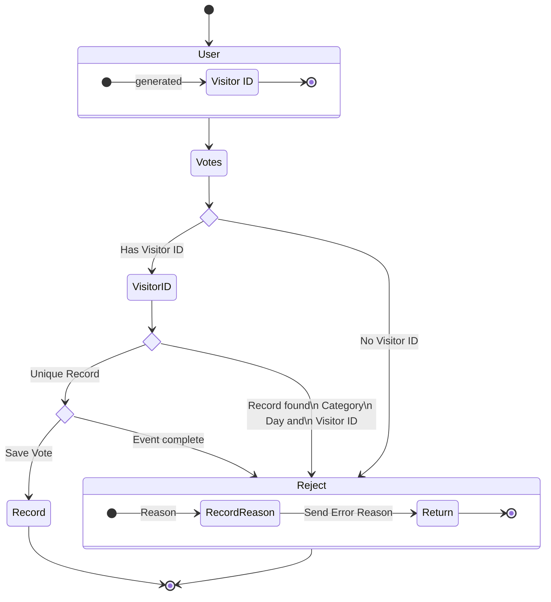

# The Problem

A business-to-business event held annually in New Mexico needed a better way to manage attendees, voting, and, contacts. After approaching the person who ran the event brainstorming ensued. Voting at the event was with glass bowls and business cards. If there was a way to move this process online people could advertise the competition, their business, and the event. Attendee management was using printed spreadsheets which was a slow process and often created long queues at the door. After the event infographics were sent to attendees which took a long time to compile and aggregate.

# The Solution

This was the first major project worked on. Originally written in Meteor and deployed using a docker container with a web and mobile frontend the app had a multitude of duties.

## Voting

B2B Expo NM has a competition in which the best brand is voted on. Participants would vote on their favorite company based on their branding and messaging in two categories, for-profit and non-profit.

To create this, a web page displayed the businesses with links to their bio, social media, and websites to review their brand. Then when a user decided on their vote for best brand they could log a vote for each category. 
To keep interest high during this phase a user was allowed to vote once a day for a company in both categories. To ensure uniqueness, FingerprintJS was used to create a unique visitor ID. This was then stored with the date, company ID, and category to ensure votes were stored once. This would continue until fifteen minutes before the winners were announced.

To ensure these rules were followed a controller was set up for the voting endpoint. 

