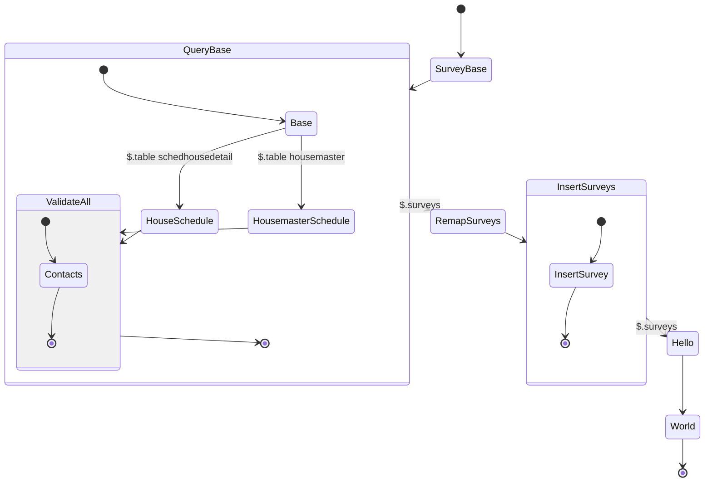

## The Problem
Construction is a long process and making sure a customer is happy throughout a build is challenging and the highest priority.

---

## The Solution

- Infrastructure
  - [Pulumi](/skills) to create the backend
  - GitLab as the CI/CD environment
  - NodeJS as the backend
- Frontend
  - React for the Dashboard
  - Yarn and Turborepo for managing the Monorepo
  - Mjml for creating email templates

---

## The Process

This has been the longest running project. It was initially started in June 2019. Originally created with Serverless and using Razzle and React for a backend. 

When COVID hit, the project was paused and we needed to focus on other aspects of the business.

### Restart

With some time away from the project I realized there were many opportunities for improvement.

<!-- First - the survey was included with the application which wasn't a necessary feature.
 -->
Initially the project had surveys built in because we wanted custom functionality in the surveys. Later I found out that Typeform has methods for embedding data into forms that would take care of our use case and ease the programming load.

The app structure

