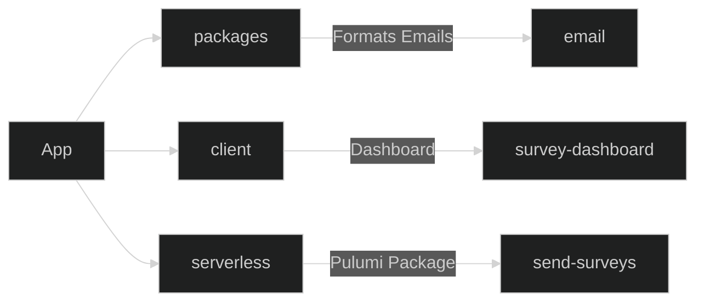
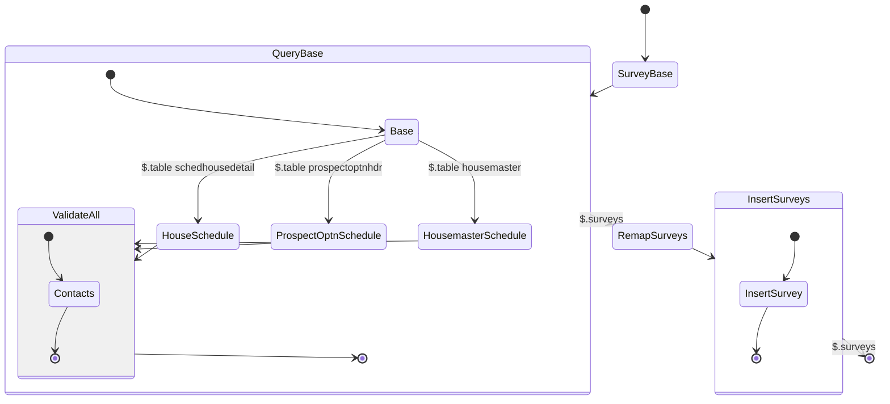

# The Problem
Constructing a dream home is a long process, ensuring a customer is happy throughout their build is the highest priority.

---

<!-- TODO: Add team leader/manager information ie. talking to multiple departements -->
<!-- TODO: Add same info to description in work experience -->
# The Solution
Developed an algorithm and dashboard to monitor the progression and customer satisfaction of the clients' homes. The algorithm sends surveys to the clients and the dashboard updates survey statuses. 
- Infrastructure
  - [Pulumi](/tags/pulumi) to create the backend
  - [GitLab](/tags/git-lab-ci) as the CI/CD environment
  - [NodeJS](/tags/node-js) as the backend
- Frontend
  - [React](/tags/react) for the dashboard
  - Yarn and Turborepo for managing the Monorepo
  - Mjml for creating email templates

---

# The Process

<!-- Beginning in June 2019, this has been the longest running development process. Originally developed with Serverless, using Razzle and React for the backend. 

Once the pandemic began, higher priority issues came to light pausing the project until January 2022.  -->

<!-- The project was initially designed to be a standalone application. However, after  -->

<!-- ## Initial -->

<!-- ## Restart -->

<!-- Having taken a step back, opportunities for improvement were realized. -->

<!-- First - the survey was included with the application which wasn't a necessary feature.
 -->
Initially the project had built-in surveys to provide custom functionality. Later discovering that Typeform contains methods for embedding data into forms that would manage the use case and ease the programming load.

The rewrite of this project required data access between both the dashboard [GitLab Pages](/tags/git-lab-ci) package and [Pulumi](/tags/pulumi)

Basic app structure:

Using a Monorepo for this project efficiently allowed type sharing between projects. The Pulumi package uses Step Functions and a Rest API to expose endpoints to the dashboard.

### State Machine
The state machine links the steps necessary for generating and sending surveys. After many iterations a design was created that allowed the greatest flexibility and speed to the process. 

<!-- NOTE: May be delete this -->
The previous iteration of this project had required all information present at each step of the flow. This slowed down processing and created more room for errors. 

By starting with a single source of truth, the survey trigger, multiple issues were avoided. 

<!-- Needs work but essentially -->
- No false positives
  - Customers that had cancelled but still had root (house) information tied to them
  - Padding and precursors 
    - Using completion tasks outside of customers means

