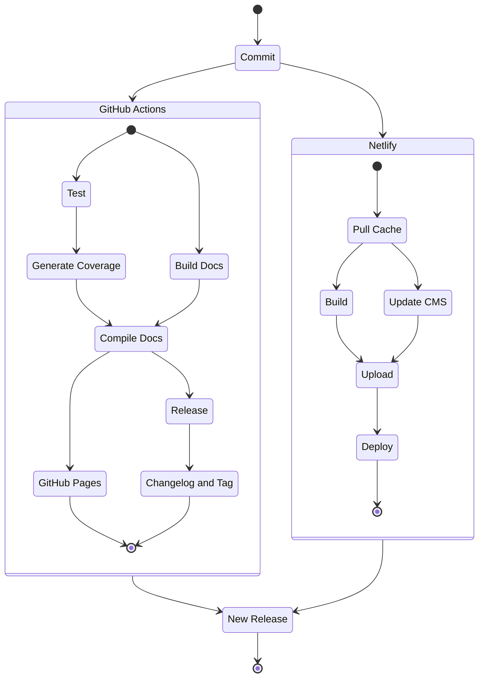
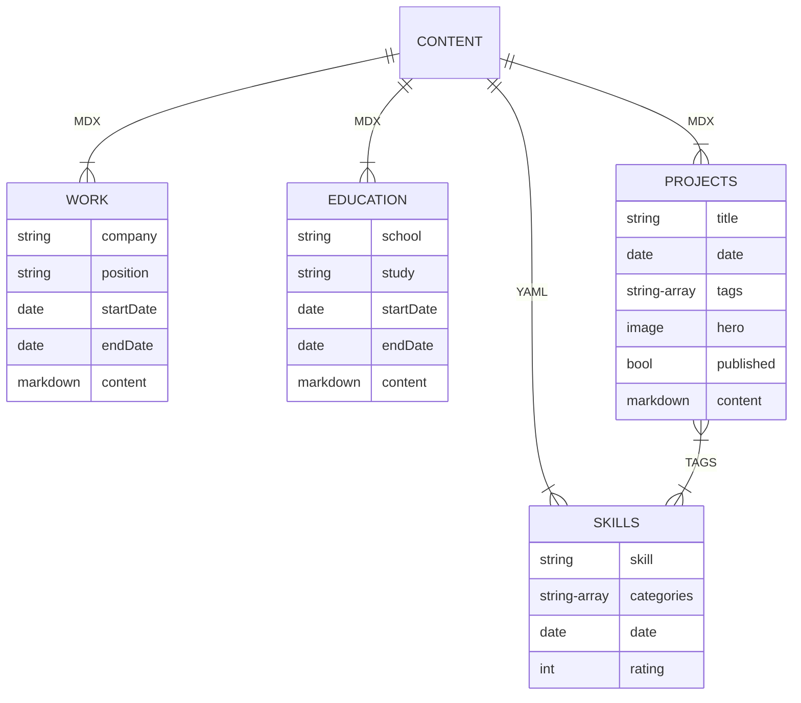

import {PDFDisplay} from '../../../src/components/pdf-display';

# The Problem

It was time to write a résumé and I wanted to have fun making it. Since I do enjoy a good problem I figured I would find a way to build a résumé and portfolio all in one. Ideally this would involve learning some new technologies along the way.

# The Solution

## Structure

I chose to use [NX](https://nx.dev/) for the project. The ease of generating components, apps, and libraries fast while having them linked quickly allowed fast iterations.

## Design

I really liked the look of Glassmorphism and I wanted to try and implement some of that style into the design. For the frontend library I choose MUI because I have used it in the past and the ability to customize quickly would help during the design process.

## CI Process

As this was my first time using GitHub Actions there was a bit of a learning curve. However, after multiple iterations I found a flow I liked.

By laying out the deployment process this way I could achieve quick build times and address errors sooner. If a test failed, the path was immediately displayed and could be navigated to quickly. If a build failed Netlify's build log would share detailed logs with where the error arose. 

# Features

## Gatsby Source Nodes

Thanks to Gatsby sourcing content is a breeze. I chose to use MDX so that I can augment markdown with React components for projects such as [360 Panos](/projects/360-panos). This also allowed me to add images and graphs alongside text content.

For skills a basic YAML file added allowed reading in skills with categories, ratings, and estimated start date.

## Automatic Resume Generation

Using Markdown data resume content is automatically parsed and saved for display.

<PDFDisplay />
