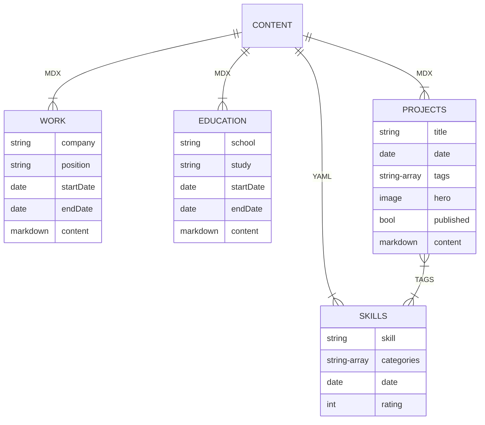
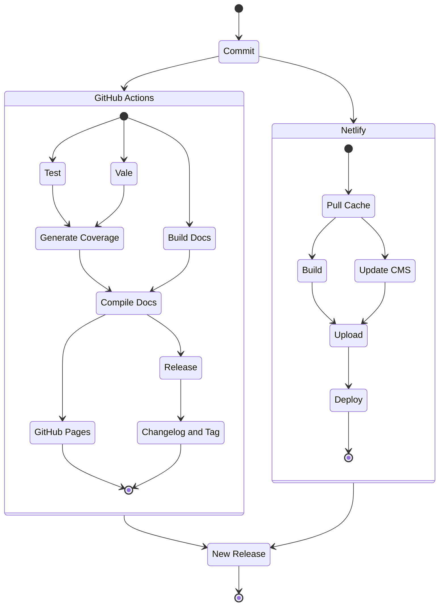

import {PDFDisplay} from '../../../src/components/pdf-display';

# The Problem

It was time to write a résumé and I wanted to have fun making it. Since I do enjoy a good problem I figured I would find a way to build a résumé and portfolio all in one. Ideally this would involve learning some new technologies along the way.

# The Solution

## Structure

I chose to use [NX](https://nx.dev/) for the project. The ease of generating components, apps, and libraries fast while having them automatically linked allowed fast iterations.

## Design

I really liked the look of Glassmorphism and I wanted to try to implement some of that style into the design. For the frontend library I choose MUI because I have used it in the past and the ability to customize proved helpful during the design process.

## Site

I chose to use Gatsby for the development of the site. Thanks to Gatsby sourcing content is a breeze. Content comes from Markdown and YAML files. Markdown then is parsed using MDX then it can be augmented with React components for projects such as [360 Panos](/projects/360-panos). This also allowed adding images and graphs within text content. For skills, a basic YAML file added allowed reading in skills with categories, ratings, and estimated start date. The general content setup is as follows.

Gatsby also has the ability to add plugins for adding features to the build of your site. You can also locally host your own. I created a plugin to generate Open Graph Images based off the hero image and title of the project. This step utilized Jimp and a small WASM library to crop modify and combine the hero image and text needed. 

## Automatic Resume Generation

Though it would be nice if everyone wanted to just view the portfolio for the most up-to-date information, it is not likely. This led me to create a library for parsing MDAST data and adding the information to a PDF.

This function is run at build time from the source files and saved to the public folder for serving. This means that all resume content is generated automatically and no more double data entry! That means the PDF below always has the most accurate data available.
<!-- Using Markdown data resume content is automatically parsed and saved for display. -->

<PDFDisplay />

## CI Process

This was my first time using GitHub Actions and there was a bit of a learning curve before there were results. However, after multiple iterations I found a flow I liked.

By laying out the deployment process this way I could achieve quick build times and address errors sooner. If a test failed, the path was immediately displayed and could be navigated to quickly. If a build failed Netlify's build log would share detailed logs with where the error arose. 

One of the best additions to this workflow was Vale. Vale is an open source program that will check the content of your code and provide suggestions and point out errors. You can even provide different style guides for what you are writing. I highly recommend checking it out.

# The Conclusion

This project was a joy to complete. I hope you enjoyed it and if you would like to learn more about it here is the link to the [repository](https://github.com/alexwine36/Portfolio).

Feel free to reach out with comments, questions, or concerns, and thank you for checking it out.

