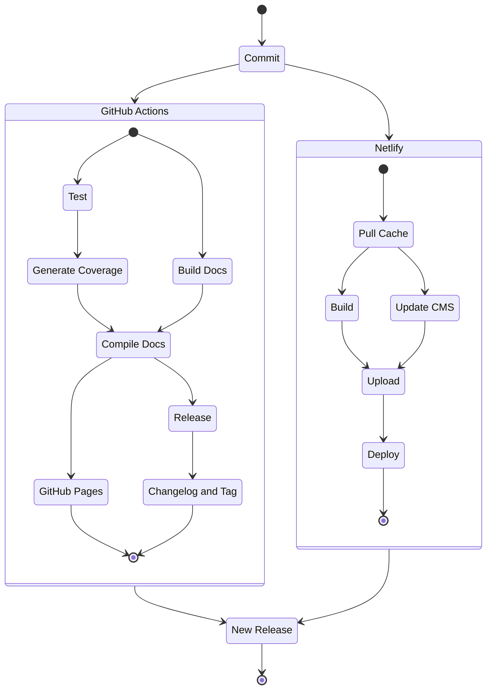

import {PDFDisplay} from '../../../src/components/pdf-display';

# The Problem

It was time to write a resume and I wanted to have fun making it. Since I do enjoy a good problem I figured I would find a way to build a resume and portfolio all in one. Ideally this would involve learning some new technologies along the way.

## CI Process

As this was my first time using GitHub Actions there was a bit of a learning curve. However, after multiple iterations I found a flow I liked.

By laying out the deployment process this way I could achieve quick build times and address errors sooner. If a test failed, the path was immediately displayed and could be navigated to quickly. If a build failed Netlify's build log would share detailed logs with where the error arose. 

# Features

## Automatic Resume Generation

Using Markdown data resume content is automatically parsed and saved for display.

<PDFDisplay />
