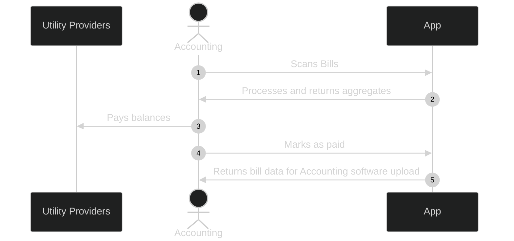
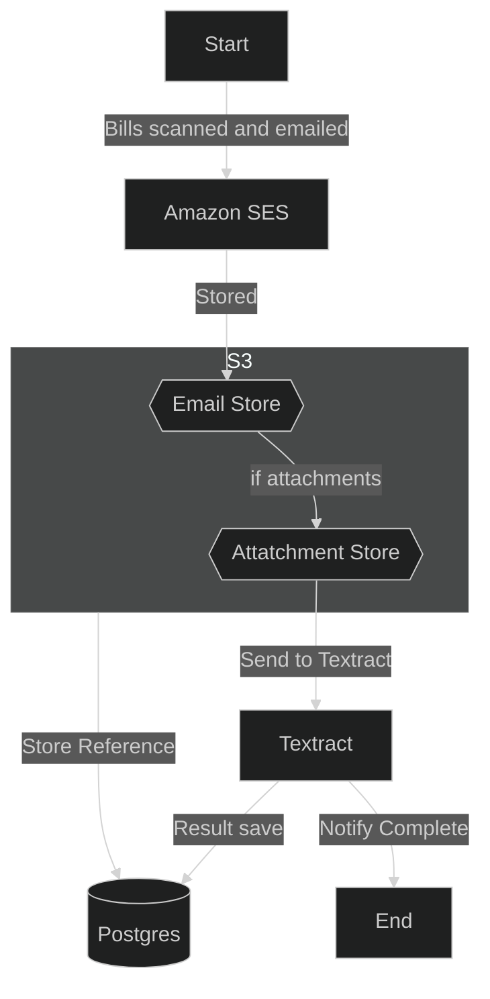
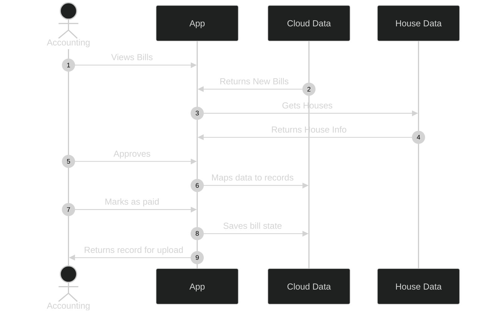

# The Problem

Utility providers mail bills for all houses under construction. They then need to be collated, paid and, recorded into the accounting software. This needs to be repeated for every house and every provider once a month. 

Occasionally new homeowners forget to call utility providers and switch utilities to their name, causing lost revenue and lost time. 

There needed to be a more efficient method of receiving, organizing and, managing these bills.

# The Solution

If bills are stored digitally multiple issues can be addressed:
1. Efficient indexing
   1. If fields from bills can be parsed then they can be stored and searched quickly
   2. This would allow grouping by house, provider, neighborhood, etc.
2. Efficient storage 
   1. A cloud provider takes up much less space than approximately 80 house's utility bills.
   2. This storage can then be tiered to save costs associated with storage
3. No more repeat bills
   1. Searching bills based on house, date, or invoice number allows for a quick check to make sure it hasn't been entered before.
4. Check customer hasn't closed
   1. By linking bills to houses we can check that the house hasn't closed.
   2. If it has we can return the customer's information to check if it is a remaining bill of ours or if we should alert the homeowner.

## User Flow

## Backend Flow

## Frontend Flow

  - Scanned and emailed to account on AWS
  - Stored in AWS Bucket
  - Textract used to gather information from bills
