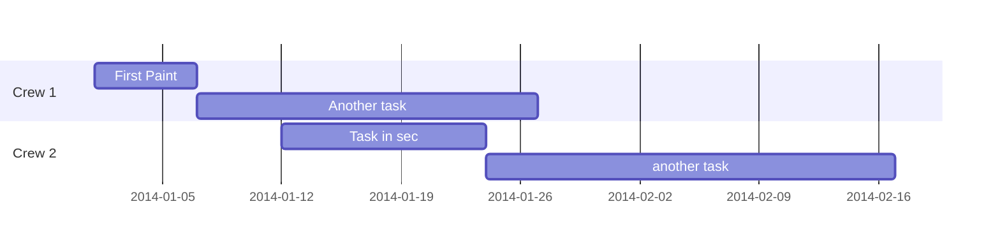
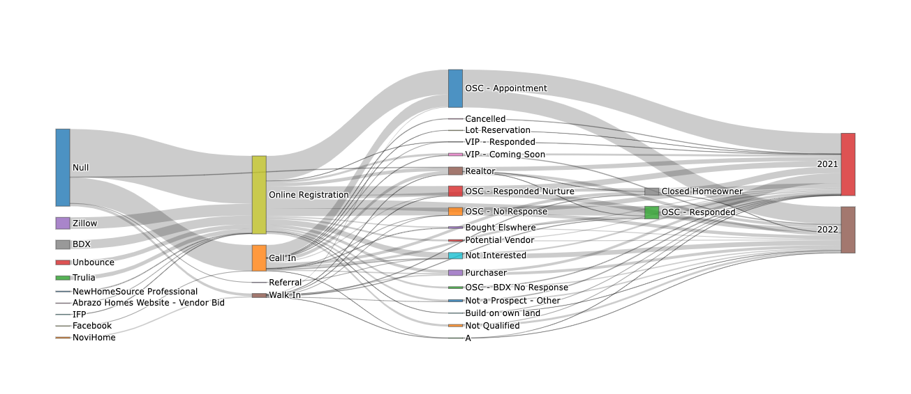

<!-- - The Problem
  - Tableau doesn't always have the necessary flexibilty to display data -->

# The Problem

Tableau is an incredibly powerful software; however, sometimes you need a bit more flexibility than it can provide. 

# The Solution

Tableau Extensions to the rescue! Using Tableau's Extensions API, data can be pulled into a dashboard for modification or display.

## Uses

This setup has been used for a number of Abrazo's dashboards. Two of the most beneficial were the vendor load and sales pipeline display.

Increasing business is always important but scaling intelligently is vital to a company's success. As we communicated with vendors it was clear that some vendors understood the importance of scaling better than others. 

For example, let's pretend you own a painting company. You have the following tasks:
1. First Paint
   1. Prime walls
   2. Rough paint for walls
   3. Spray trim
2. Exterior Paint
   1. Paint electrical box
   2. Paint accents and fascia
   3. Paint garage door
3. Final Paint
   1. Doors and trim touchup
   2. Caulk openings and trim
   3. Touch up walls and ceilings
4. Paint punch
   1. Come back to touch up missed items

With Tableau providing data to the extension, it is then possible to manipulate the data. 

<!--

-->
