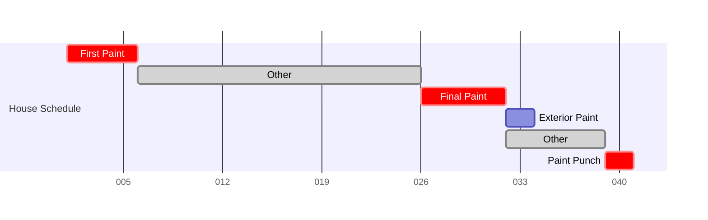

<!-- - The Problem
  - Tableau doesn't always have the necessary flexibilty to display data -->

# The Problem

Tableau is an incredibly powerful software; however, sometimes you need a bit more flexibility than it can provide. 

# The Solution

Tableau Extensions to the rescue! Using Tableau's Extensions API, data can be pulled into a dashboard for modification or display.

## Uses

This setup has been used for a number of Abrazo's dashboards. Two of the most beneficial were the vendor load and sales pipeline display.

Increasing business is always important but scaling intelligently is vital to a company's success. As we communicated with vendors it was clear that some vendors understood the importance of scaling better than others. 

As we communicated with vendors it was clear that some understand this better than others. 

As an example we will pretend you own a painting company. 

You have the following tasks:
1. First Paint
   1. Prime walls
   2. Rough paint for walls
   3. Spray trim
2. Exterior Paint
   1. Paint electrical box
   2. Paint accents and fascia
   3. Paint garage door
3. Final Paint
   1. Doors and trim touch-up
   2. Caulk openings and trim
   3. Touch up walls and ceilings
4. Paint punch
   1. Come back to touch-up missed items

With Tableau providing data to the extension, it is possible to aggregate and manipulate the data. The extension allows you to calculate a house completion timeline by averaging task durations and the estimated frequency of house visits. This timeline provides a template to better inform the number of houses you are able to get under contract without overloading the business and delaying current projects. 

With tableau providing the data and averages for tasks and time between them, the extension can then play with the data. 

<!-- Because first paint, final paint and, paint punch are blocking this is where issues tend to pop up. -->

Starting a house is the quickest part. It requires little time and has a large gap before the next stage of the house. Once the house gets to later stages is when issues arise, there is less time between tasks and most tasks block other steps.
By displaying this information to vendors it helped them plan the number of houses they could feasibly manage and the number of crews they would need to achieve their business goals.

-->
