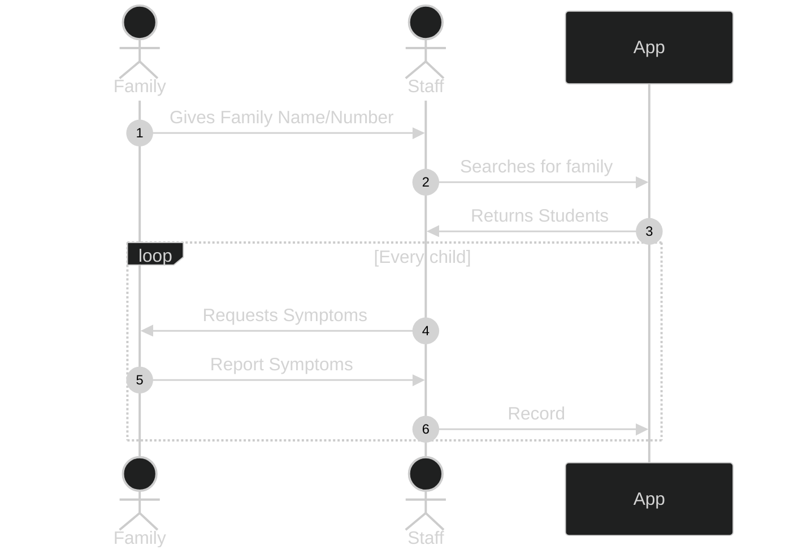

# The Problem

During COVID, a school local to the area needed a quick way to check-in students every morning. The previous process involved using a spreadsheet to record student's information based on the block day and grade. This process had a lot of redundant steps and was inefficient for staff, students, and, teachers. 

# The Solution

The desired process for checking in students needed to be quick and straightforward for teachers and families. After some discussion on what it could look like the basic flow was decided on.




Using this flow complicated the backend design but, would make checking in faster for families of all sizes. Instead of searching for students individually, a grouped record would help get parents moving quicker through the drop off line. 


The data that the school sent contained students grouped by the family members that could pick them up. This appeared to be a straight-forward mapping, however, not all children under those family groups had the same family members dropping off.

Since this was a weekend project done free of charge I wanted to make sure the school had the ability to update their own information. Which meant setting up users and a database to effectively manage the needed information.


The structure for the database[^postgres] used a many-to-many relationship for students and families. This resolved the issue of students having different parents and, maintained the goal of quick searching at the drop off line.

Basic Database Structure[^Prisma]
```mermaid
%%{init: {'theme': 'dark'} }%%
erDiagram
          FAMILY }o--o{ STUDENT : many-to-many
          CHECK-IN }o--|| STUDENT : has
          STAFF ||--|| USER : is
          CHECK-IN ||--|| USER : from

          
```

For the framework I chose NextJS since I needed a stable backend, and with the database schema decided, I used Prisma to generate the ORM and Apollo GraphQL to serve it to the frontend. By using families as groups on their own table, searching was incredibly efficient. 

Over the course of nine months the project recorded 7,880 check-ins from 153 families using 37 different staff members. Cutting down the time to check-in students and adding the ability to have multiple staff to check-in students simultaneously. 


[^postgres]: PostgreSQL

[^Prisma]: Prisma


<!-- Able to check-in 153 families with 208 students.  -->
